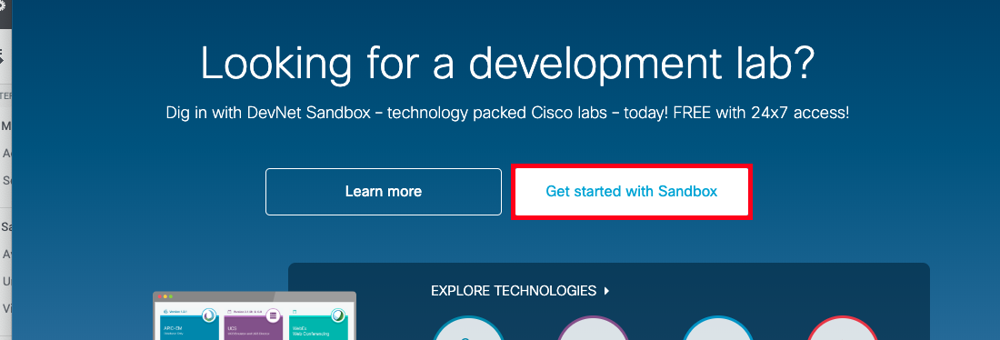
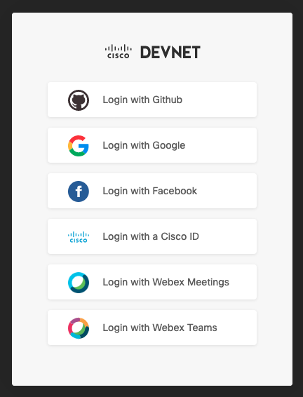
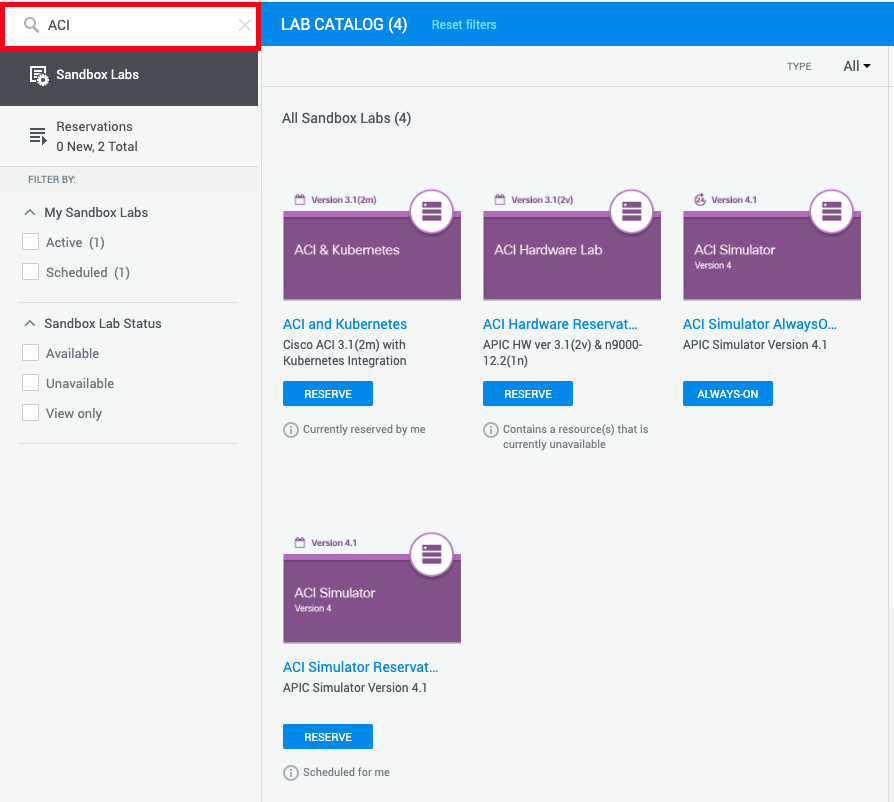
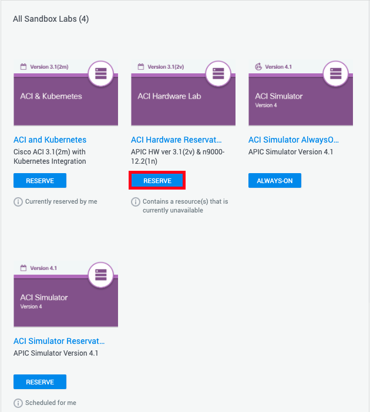
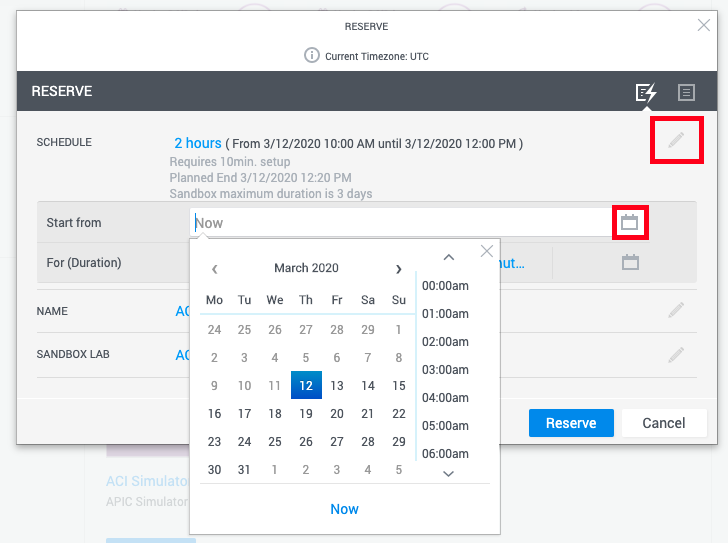
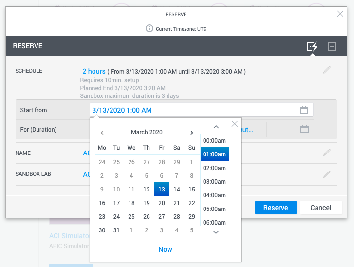
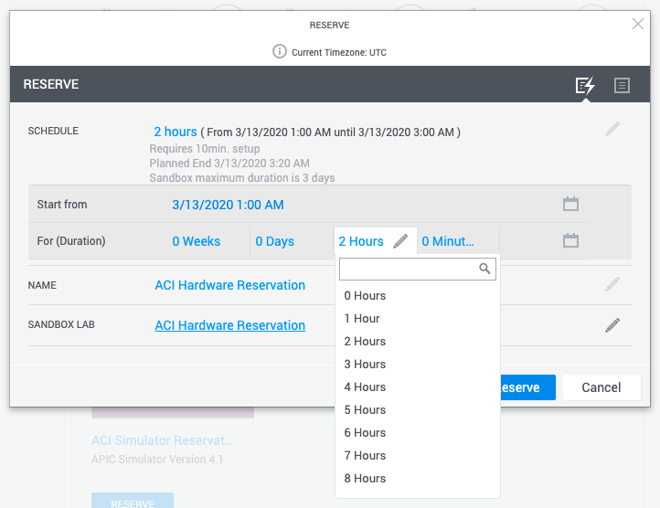

ここでは、Ciscoが提供しているDevNetを使って検証用のACI(Application Centric Infrastructure)を準備する方法について説明します。

# DevNetの予約方法

DevNetでは、Ciscoが用意してくれているシミュレーターや機器を使って無料で検証することができます。
環境は共有のものと専用できるものがあり、後者の場合は予約が必要です。
そのため、注意点としては当日使いたくても予約できない場合があるため前日までに予約するのをお勧めします。
人気な検証環境(例えば、実機環境など)は数ヶ月先まで予約されていることがあります。(諦めてシミュレーターを使いましょう)
また、時間帯によっては結構遅延が発生したりしたりします。（通常、シミュレーターの場合落ち着けば300ms〜600ms位でした）

## ログイン

まずは、次のURLへアクセスしてログインします。

[https://developer.cisco.com/site/sandbox/](https://developer.cisco.com/site/sandbox/)

**Get started with Sandbox** をクリックします。

ログインを求められるので次のどれかを選択してDevNetのアカウントを作成します。

## Sandboxを選ぶ

**Search Sandbox Labs** に **ACI** を入力してACI Labを検索します。

Sandboxには **ALWAYS-ON** と **RESERVE** の2種類が存在します。

### ALWAYS-ONについて

ALWAYS-ONは常に起動しているSandbox Labです。
このLabはいつでも誰でもすぐに使うことができる共有Labです。
そのため、予約は必要ありません。
ただ、自分専用ではないので、例えば自分で作ったテナントを誰かが間違って消してしまうということもありえると思います。

### RESERVEについて

RESERVEは自分専用のLabです。
使う場合は、AnyConnectを使ったVPN接続をする必要があります。
予約した時間になると自動で環境構築が始まります(10分程度で完成する)。
環境が出来上がったらDevNetから送信されてきたメールにVPNの接続先とアカウント、パスワードが記載されているので、それを参考に接続します。
後は、管理者権限があるので好きに使えます。
ただし、シミュレーターの場合は結構遅延があるので慣れる必要があります。

**RESERVE時の注意事項**

Labは米国にあるため時差が9時間あります。
予約時に表示される時間は9時間前になるので、そこを注意して予約する必要があります。
例えば、10時に使いたい場合は以下のように1:00で予約します。

|   米国時間   |    日本時間   |
|--------------|---------------|
| 3/12 1:00 AM | 3/12 10:00 AM |
| 3/12 2:00 AM | 3/12 11:00 AM |
| 3/12 3:00 AM | 3/12 12:00 PM |

当日、リソースが空いていれば特に事前予約しなくてもそのままRESERVE処理でLabが払い出されます。
予約の仕方は以下の通りです。

対象のSandbox Labの **RESERVE** をクリックします。

鉛筆マークをクリックして **Start from** のカレンダーマークをクリックします。
(もし、すぐ使いたい場合は当日の予約時間だけ変えて **Reserve** をクリックします。リソースが空いていればすぐ払い出されます。)

例えば、3月13日の10時(JST)から使いたい場合は、以下のように日付と時間を選択します。

そして **For(Duration)** で使用期間を選択します。

最後に **Reserve** ボタンを押してリソースが空いていれば予約完了です。
もし、予約できない場合は時間をずらして試してみてください。
