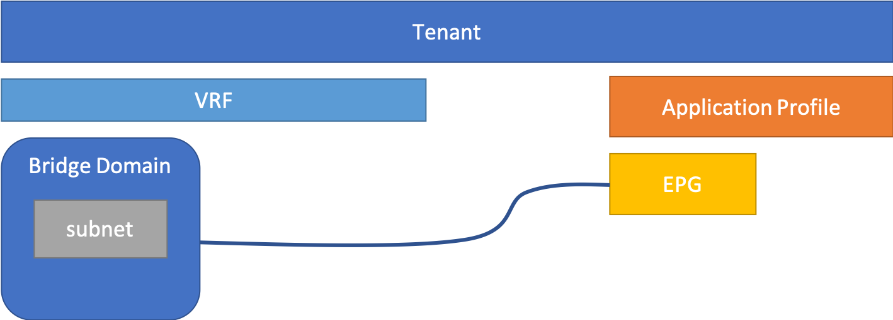

ここでは、DevNetのACI教材にあるイントロダクションにあるテナント環境を自動で構築してみます。

# 教材

[https://developer.cisco.com/learning/lab/sbx-intro-aci-01_understanding-aci/step/1](https://developer.cisco.com/learning/lab/sbx-intro-aci-01_understanding-aci/step/1)

ACIの基礎イメージは上記のドキュメントを参照ください。

# やること

* ACIでテナントを作成する
* テナント内にVRFを作成する
* Bridge Domainを作成する
* Bridge Domainにsubnetを作成する
* Application Profileを作成する
* Application ProfileにEPGを作る
* 最後にBridge DomainとEPGを紐づける

イメージは以下のようになります。


完成系です。



# Playbook

以下のPlaybookで構築の自動化ができます。
各パラメーターについては、コメントのモジュールリンクを確認してください。
`aci_auth_info` はRESERVEかALWAYS-ONで変更してください。

```yaml
---
- name: ansible aci module test
  hosts: localhost
  gather_facts: no
  vars:
    aci_auth_info: &aci_auth_info
      hostname: sandboxapicdc.cisco.com
      username: admin
      password: ciscopsdt
      validate_certs: no
    tenant_name: TenantB
    tenant_description: TEST
    vrf_name: VRF_B
    bd_name: bd01
    subnet_name: subnet_b
    subnet_description: test subnet b
    gateway: 100.64.1.1
    subnet_mask: 24
    ap_name: ap_b
    ap_description: application profile b
    epg_name: epg01
    epg_description: end point group 01
  tasks:
    # https://docs.ansible.com/ansible/latest/modules/aci_tenant_module.html#aci-tenant-module
    - name: create a tenant
      aci_tenant:
        <<: *aci_auth_info
        tenant: "{{ tenant_name }}"
        description: "{{ tenant_description | default('') }}"
        state: present

    # https://docs.ansible.com/ansible/latest/modules/aci_vrf_module.html#aci-vrf-module
    - name: create VRF for a tenant
      aci_vrf:
        <<: *aci_auth_info
        tenant: "{{ tenant_name }}"
        vrf: "{{ vrf_name }}"
        state: present

    # https://docs.ansible.com/ansible/latest/modules/aci_bd_module.html#aci-bd-module
    - name: create bridge domain
      aci_bd:
        <<: *aci_auth_info
        tenant: "{{ tenant_name }}"
        vrf: "{{ vrf_name }}"
        bd: "{{ bd_name }}"
        bd_type: ethernet
        state: present

    # https://docs.ansible.com/ansible/latest/modules/aci_bd_subnet_module.html#aci-bd-subnet-module
    - name: create subnet
      aci_bd_subnet:
        <<: *aci_auth_info
        tenant: "{{ tenant_name }}"
        bd: "{{ bd_name }}"
        subnet_name: "{{ subnet_name }}"
        gateway: "{{ gateway }}"
        mask: "{{ subnet_mask }}"
        description: "{{ subnet_description | default('') }}"
        state: present

    # https://docs.ansible.com/ansible/latest/modules/aci_ap_module.html#aci-ap-module
    - name: create application profile
      aci_ap:
        <<: *aci_auth_info
        tenant: "{{ tenant_name }}"
        ap: "{{ ap_name }}"
        description: "{{ ap_description | default('') }}"
        state: present

    # https://docs.ansible.com/ansible/latest/modules/aci_epg_module.html#aci-epg-module
    - name: create end point group
      aci_epg:
        <<: *aci_auth_info
        tenant: "{{ tenant_name }}"
        ap: "{{ ap_name }}"
        bd: "{{ bd_name }}"
        epg: "{{ epg_name }}"
        description: "{{ epg_description | default('') }}"
```

# 実行

実行例です。

```
% ansible-playbook main.yml
(snip)
PLAY [ansible aci module test] *****************************************************************************************************

TASK [create a tenant] *************************************************************************************************************
changed: [localhost]

TASK [create VRF for a tenant] *****************************************************************************************************
changed: [localhost]

TASK [create bridge domain] ********************************************************************************************************
changed: [localhost]

TASK [create subnet] ***************************************************************************************************************
changed: [localhost]

TASK [create application profile] **************************************************************************************************
changed: [localhost]

TASK [create end point group] ******************************************************************************************************
changed: [localhost]

PLAY RECAP *************************************************************************************************************************
localhost                  : ok=6    changed=6    unreachable=0    failed=0    skipped=0    rescued=0    ignored=0
```

結果確認例です。


