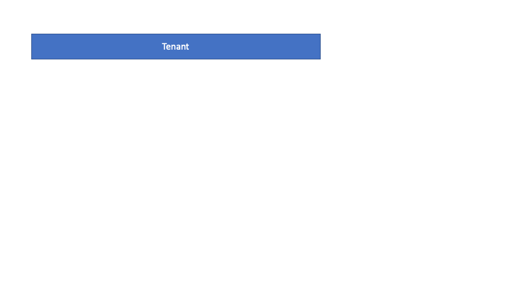
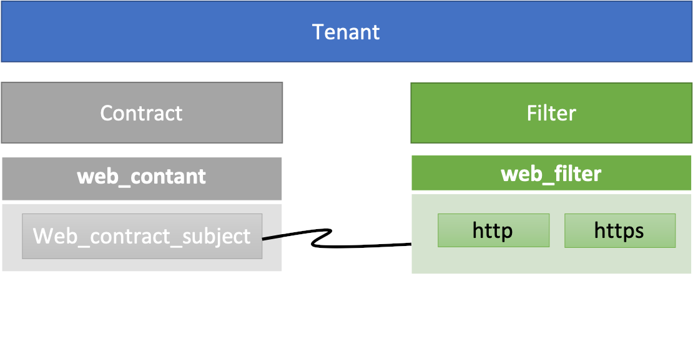
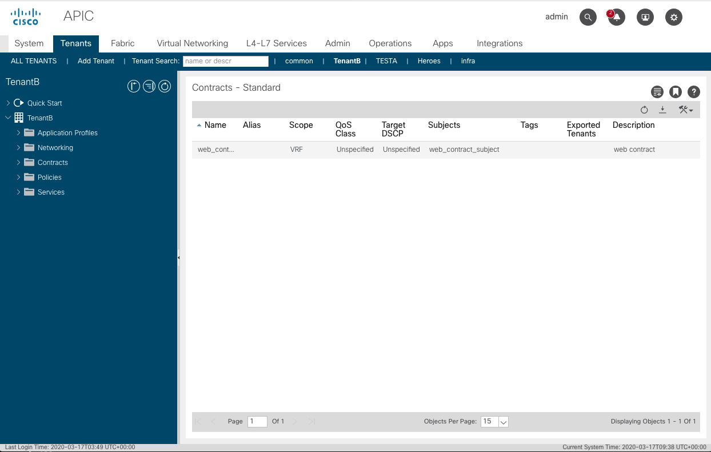

EPGを繋ぎ合わすために必要なContractとFilterを自動で作成してみます。

# やること

* アクセス制御をするFilterを作る
    * ここでは `http` と `https` を作ってみます
* Contractを作成する
* 作成したContractにSubjectを追加する
* SubjectにFilterを追加する

イメージは以下のようになります。



完成系です。



# Playbook

以下のPlaybookで構築の自動化ができます。  
各パラメーターについては、コメントのモジュールリンクを確認してください。  
`aci_auth_info` はRESERVEかALWAYS-ONで変更してください。

```yaml
---
- name: ansible aci module test
  hosts: localhost
  gather_facts: no
  vars:
    aci_auth_info: &aci_auth_info
      hostname: 192.168.37.132
      username: admin
      password: ciscopsdt
      validate_certs: no
    tenant_name: TenantB

    filter_name: web_filter
    filter_description: web filter
    filter_entries:
      - name: http
        ether_type: ip
        #arp_flag: 
        ip_protocol: tcp
        dst_port: 80
        stateful: True
      - name: https
        ether_type: ip
        #arp_flag: 
        ip_protocol: tcp
        dst_port: 443
        stateful: True

    contract_name: web_contract
    contract_description: web contract
    contract_subject_name: web_contract_subject
    contract_subject_subject: web contract subject

  tasks:
    # https://docs.ansible.com/ansible/latest/modules/aci_filter_module.html#aci-filter-module
    - name: create a filter
      aci_filter:
        <<: *aci_auth_info
        tenant: "{{ tenant_name }}"
        filter: "{{ filter_name }}"
        description: "{{ filter_description | default('') }}"
        state: present

    # https://docs.ansible.com/ansible/latest/modules/aci_filter_entry_module.html#aci-filter-entry-module
    - name: "add filter entry to {{ filter_name }}"
      aci_filter_entry:
        <<: *aci_auth_info
        tenant: "{{ tenant_name }}"
        filter: "{{ filter_name }}"
        entry: "{{ item.name }}"
        ether_type: "{{ item.ether_type | default('unspecified') }}"
        arp_flag: "{{ item.arp_flag | default('unspecified') }}"
        ip_protocol: "{{ item.ip_protocol | default('unspecified') }}"
        ip_protocol: "{{ item.ip_protocol | default('unspecified') }}"
        stateful: "{{ item.stateful | default(False) }}"
        dst_port: "{{ item.dst_port | default('unspecified') }}"
        state: present
      loop: "{{ filter_entries }}"

    # https://docs.ansible.com/ansible/latest/modules/aci_contract_module.html#aci-contract-module
    - name: create a contract
      aci_contract:
        <<: *aci_auth_info
        tenant: "{{ tenant_name }}"
        contract: "{{ contract_name }}"
        description: "{{ contract_description | default('') }}"
        state: present

    # https://docs.ansible.com/ansible/latest/modules/aci_contract_subject_module.html#aci-contract-subject-module
    - name: add a contract subject
      aci_contract_subject:
        <<: *aci_auth_info
        tenant: "{{ tenant_name }}"
        contract: "{{ contract_name }}"
        subject: "{{ contract_subject_name }}"
        description: "{{ contract_subject_subject | default('') }}"
        state: present

    # https://docs.ansible.com/ansible/latest/modules/aci_contract_subject_to_filter_module.html#aci-contract-subject-to-filter-module
    - name: "add filter to {{ contract_subject_name }}"
      aci_contract_subject_to_filter:
        <<: *aci_auth_info
        tenant: "{{ tenant_name }}"
        contract: "{{ contract_name }}"
        subject: "{{ contract_subject_name }}"
        filter: "{{ filter_name }}"
        state: present
```

# 実行

実行結果です。

```
% ansible-playbook main.yml
(snip)
PLAY [ansible aci module test] *********************************************************************************************************************************************************************

TASK [create a filter] *****************************************************************************************************************************************************************************
changed: [localhost]

TASK [add filter entry to web_filter] **************************************************************************************************************************************************************
changed: [localhost] => (item={'name': 'http', 'ether_type': 'ip', 'ip_protocol': 'tcp', 'dst_port': 80, 'stateful': True})
changed: [localhost] => (item={'name': 'https', 'ether_type': 'ip', 'ip_protocol': 'tcp', 'dst_port': 443, 'stateful': True})

TASK [create a contract] ***************************************************************************************************************************************************************************
changed: [localhost]

TASK [add a contract subject] **********************************************************************************************************************************************************************
changed: [localhost]

TASK [add filter to web_contract_subject] **********************************************************************************************************************************************************
changed: [localhost]

PLAY RECAP *****************************************************************************************************************************************************************************************
localhost                  : ok=5    changed=5    unreachable=0    failed=0    skipped=0    rescued=0    ignored=0
```

確認結果例です。



# 参考

* [Cisco ACI における Contract の基本を理解する](http://sig9.hatenablog.com/entry/2017/06/21/120000)
