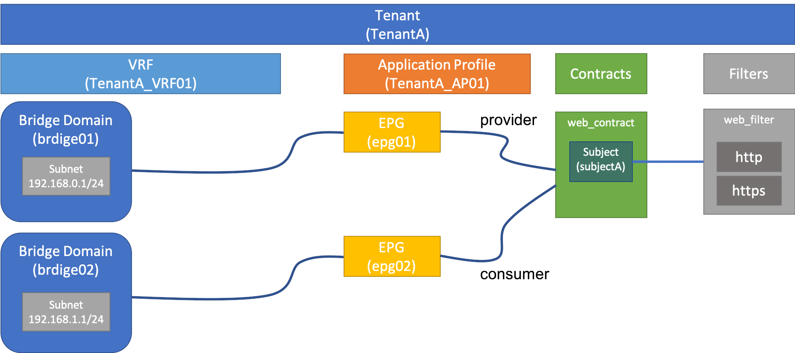

ACIの基本的なテナント構成を自動で作ってみます。

# やること

以下の構成を自動で作ってみます。



# Playbookサンプル

Playbookのサンプルは以下に保存されています。

**サンプル**

[https://github.com/sky-joker/CiscoACIAutomationJourneyWithAnsible/tree/master/docs/contents/005/sample](https://github.com/sky-joker/CiscoACIAutomationJourneyWithAnsible/tree/master/docs/contents/005/sample)

サンプルをそのまま実行するとDevNetのALWAYS-ONの方に自動でテナントが構築されます。  
ちなみに、サンプルのPlaybookはロール化しておらず一先ず動作確認をしたかっただけなので単純にタスク毎でファイルを分けています。  
各タスクファイルは以下のとおりです。

## 変数ファイル

変数ファイルは `vars` ディレクトリ配下に存在します。

### aci_auth_info.yml

ACIの認証情報を記述する変数ファイルです。

### aci_parameters.yml

ACIのテナント構成を記述する変数ファイルです。  
テナントに必要な変数はテナント毎に定義できます。  
指定可能な変数は、この変数ファイルに記述してあるもののみ可能です。

## タスクファイル

### main.yml

ACIの基本的なテナント構成を自動で生成するmain Playbookです。  
main Playbookからは、いくつかのタスクファイルを読み込んでいます。  
読み込んでいるタスクファイルは以下のとおりです。

#### add_subnets_to_bridge_domain_tasks.yml

Bridge Domainにsubnetsを追加するPlaybookです。

#### add_filter_entry_tasks.yml

作成したfilterにentryを追加するPlaybookです。

#### create_content_subject_tasks.yml

作成したcontractにsubjectを作成するPlaybookです。  
このPlaybookからはsubjectにfilterを追加する次のタスクを読み込んでいます。

##### add_filter_to_contract_subject_tasks.yml

contractのsubjectにfilterを紐付けるPlaybookです。

#### create_end_point_group_tasks.yml

Application ProfileにEnd Point Group(EPG)を追加するPlaybookです。  
このPlaybookからはEPGにcontractを追加する次のタスクを読み込んでいます。

##### add_contract_to_end_point_group_tasks.yml

EPGにcontractを紐づけるPlaybookです。

## 使い方

サンプルの使い方です。  
まずは、リポジトリをクローンします。

```bash
% git clone https://github.com/sky-joker/CiscoACIAutomationJourneyWithAnsible.git
```

サンプルまで移動します。

```bash
% cd CiscoACIAutomationJourneyWithAnsible/docs/contents/005/sample
```

必要な場合は認証情報を修正します。

```bash
% vi vars/aci_auth_info.yml
```

必要な場合はテナント構成のパラメーターを環境に合わせて変更します。

```bash
% vi vars/aci_parameters.yml
```

`main.yml` を実行します。

```
% ansible-playbook main.yml
```

結果確認例です。


