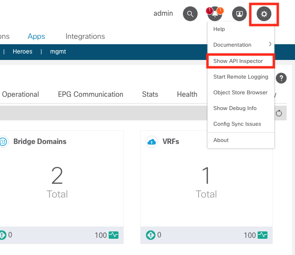
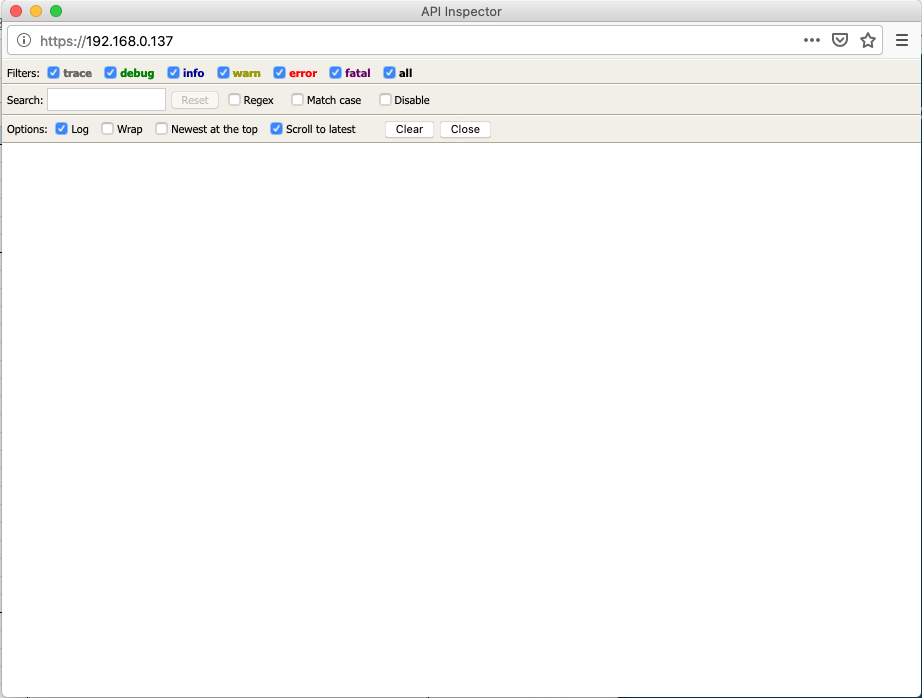

Cisco ACIには、Web UIで操作した内容をWebのリクエストとして確認できる `Show API Inspector` というツールが備わっています。  
これを使う事で、具体的にどういったリクエストがAPIでやりとりされているか確認できます。  
APIリファレンスを観てもよく分からない時は、実際に動いている内容を確認するのが手っ取り早いです。

# Show API Inspectorの使い方

## ツールを立ち上げる

ACIのWeb UIログイン後、画面右上にある `Help and tool` をクリックして `Show API Inspector` を起動します。



`Show API Inspector` が起動すると以下のツールが表示されます。



この状態でWeb UIを操作するとやりとりが記録されます。

## 表示結果の例

以下の例は、Web UIでcontractを作成したものになります。

```
timestamp: 18:36:16 DEBUG 
method: POST
url: https://192.168.0.137/api/node/mo/uni/tn-TenantA/brc-test.json
payload{"vzBrCP":{"attributes":{"dn":"uni/tn-TenantA/brc-test","name":"test","rn":"brc-test","status":"created"},"children":[]}}
response: {"totalCount":"0","imdata":[]}

timestamp: 18:36:16 DEBUG 
method: Event Channel Message
response: {"subscriptionId":["72057598349803551","72057598349803552","72057598349803553","72057598349803561"],"imdata":[{"vzBrCP":{"attributes":{"annotation":"","childAction":"","configIssues":"filter-not-present","descr":"","dn":"uni/tn-TenantA/brc-test","extMngdBy":"","lcOwn":"local","modTs":"2020-04-13T10:43:19.237+00:00","monPolDn":"uni/tn-common/monepg-default","name":"test","nameAlias":"","ownerKey":"","ownerTag":"","prio":"unspecified","reevaluateAll":"no","rn":"","scope":"context","status":"created","targetDscp":"unspecified","uid":"15374"}}}]}

timestamp: 18:36:18 DEBUG 
method: GET
url: https://192.168.0.137/api/node/mo/uni/tn-TenantA.json?query-target=children&target-subtree-class=vzBrCP&query-target-filter=not(wcard(vzBrCP.dn,%22__ui_%22))&query-target=subtree&target-subtree-class=vzBrCP&rsp-subtree-class=vzSubj,tagInst,vzRtIf&rsp-subtree=children&subscription=yes&order-by=vzBrCP.dn|asc&page=0&page-size=15
response: {"totalCount":"2","subscriptionId":"72057598349803562","imdata":[{"vzBrCP":{"attributes":{"annotation":"","childAction":"","configIssues":"filter-not-present","descr":"","dn":"uni/tn-TenantA/brc-test","extMngdBy":"","lcOwn":"local","modTs":"2020-04-13T10:43:19.237+00:00","monPolDn":"uni/tn-common/monepg-default","name":"test","nameAlias":"","ownerKey":"","ownerTag":"","prio":"unspecified","reevaluateAll":"no","scope":"context","status":"","targetDscp":"unspecified","uid":"15374"}}},{"vzBrCP":{"attributes":{"annotation":"","childAction":"","configIssues":"","descr":"web contract","dn":"uni/tn-TenantA/brc-web_contract","extMngdBy":"","lcOwn":"local","modTs":"2020-04-13T10:32:46.734+00:00","monPolDn":"uni/tn-common/monepg-default","name":"web_contract","nameAlias":"","ownerKey":"","ownerTag":"","prio":"unspecified","reevaluateAll":"no","scope":"context","status":"","targetDscp":"unspecified","uid":"15374"},"children":[{"vzSubj":{"attributes":{"annotation":"","childAction":"","configIssues":"","consMatchT":"AtleastOne","descr":"subject A","extMngdBy":"","lcOwn":"local","modTs":"2020-04-13T10:32:40.427+00:00","monPolDn":"uni/tn-common/monepg-default","name":"subjectA","nameAlias":"","prio":"unspecified","provMatchT":"AtleastOne","revFltPorts":"yes","rn":"subj-subjectA","status":"","targetDscp":"unspecified","uid":"15374"}}}]}}]}

timestamp: 18:36:21 DEBUG 
method: GET
url: https://192.168.0.137/api/node/mo/info.json
response: {"totalCount":"1","imdata":[{"topInfo":{"attributes":{"childAction":"","currentTime":"2020-04-13T10:43:24.062+00:00","dn":"info","id":"1","podId":"1","role":"controller","status":""}}}]}
```

|    項目   |       説明       |
|-----------|------------------|
| timestamp | 実行した時間     |
| method    | 実行したメソッド |
| url       | アクセスしたURL  |
| response  | 取得した結果     |
| payload   | 送ったデータ     |

一番上のPOSTしているものがcontractを作成しています。  
これを素直に `aci_rest` に落とし込むと次のようになります。

```yaml
---
- name: cisco aci aci_rest module test
  hosts: localhost
  gather_facts: no
  vars:
    aci_hostname: sandboxapicdc.cisco.com
    aci_username: admin
    aci_password: ciscopsdt
    validate_certs: no
  tasks:
    - name: rest api demo
      aci_rest:
        host: "{{ aci_hostname }}"
        username: "{{ aci_username }}"
        password: "{{ aci_password }}"
        validate_certs: "{{ validate_certs }}"
        method: post
        path: /api/node/mo/uni/tn-TenantA/brc-test.json
        content:
          {
            "vzBrCP": {
              "attributes": {
                "dn": "uni/tn-TenantA/brc-test",
                "name": "test",
                "rn": "brc-test",
                "status": "created"
              },
              "children": [
                
              ]
            }
          }

    - debug: var=rest_api_result
```

`path` はmoを指定しており `content` はclassを指定しています。  
classは `vz:BrCP(vzBrCP)` です。ドキュメントで仕様を確認する時はコロンで区切られています。  
vz:BrCPの仕様は以下のとおりです。

[https://pubhub.devnetcloud.com/media/apic-mim-ref-421/docs/MO-vzBrCP.html](https://pubhub.devnetcloud.com/media/apic-mim-ref-421/docs/MO-vzBrCP.htm)

このようにすれば、簡単にAPI仕様の把握と実装が可能です。


